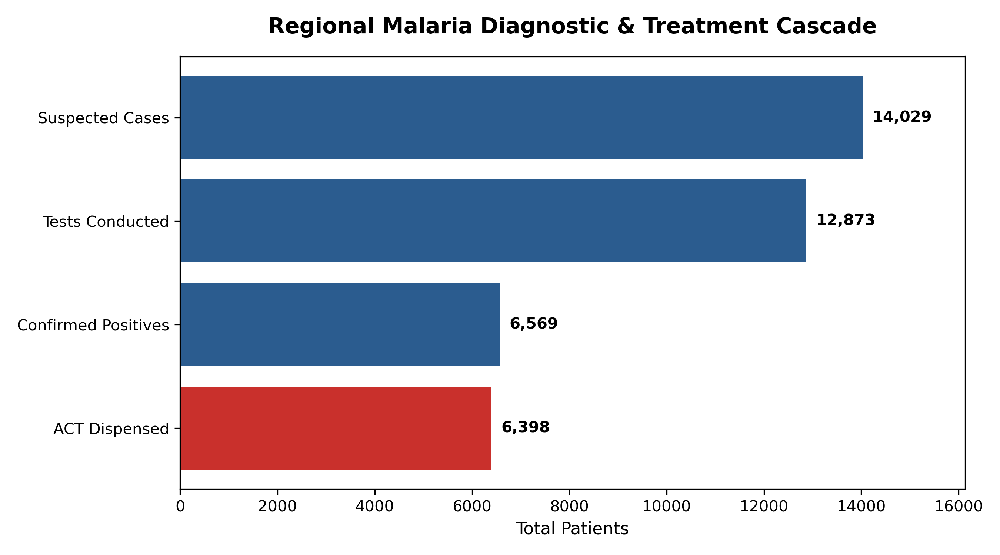
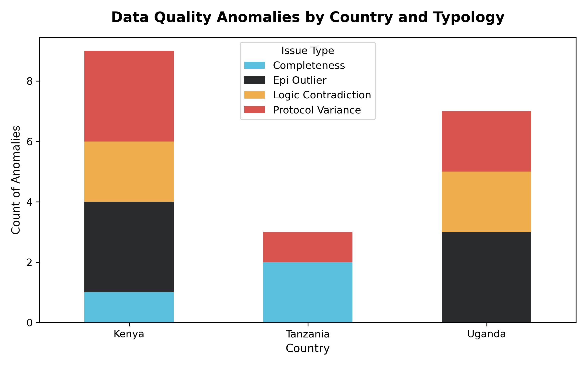
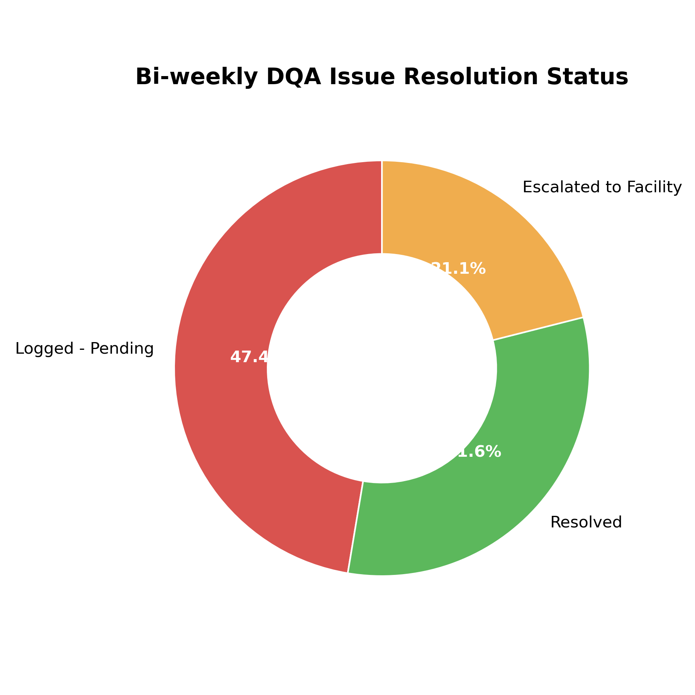

# Multi-Country Health Data Quality Assurance (RDQA) Pipeline

## Overview
This repository contains an automated Data Quality Assurance (DQA) pipeline and Monitoring, Evaluation, and Learning (MEL) visualization suite designed for multi-country public health programs. 

Modeled after the WHO Data Quality Review (DQR) standards and USAID's MEASURE Evaluation framework, this Python-based pipeline ingests routine facility-level health data, automatically flags clinical and mathematical anomalies, and generates a structured bi-weekly remediation log for country MEL focal points. 

This project demonstrates a proactive approach to ensuring audit-ready data integrity before it is fed into executive dashboards or submitted for donor reporting.

## Business Value & Impact
* **Automated DQA Execution:** Replaces manual desk reviews by processing monthly HMIS summaries against deterministic clinical logic gates.
* **Bi-Weekly Issue Logging:** Automatically generates targeted, facility-specific action items for MEL officers, significantly reducing anomaly resolution turnaround time.
* **Clinical Protocol Monitoring:** Identifies irrational prescribing practices (e.g., ACT dispensing outpacing confirmed diagnostic positives) to prevent stockouts and commodity leakage.

## Data Quality Validation Gates
The Python engine evaluates incoming programmatic data (simulated across 50 facilities in Kenya, Uganda, and Tanzania) against five strict rules:
1. **Completeness Audit:** Flags missing core indicators (e.g., null values in diagnostic testing logs).
2. **Internal Logic Consistency:** Identifies mathematical impossibilities (e.g., Confirmed Positive Cases > Total Tests Conducted).
3. **Protocol Adherence:** Highlights excessive therapeutic dispensing relative to diagnostic confirmations (allowing a 5% margin for presumptive treatments).
4. **Epidemiological Feasibility:** Flags suspicious test positivity rates (>85%), indicating potential RDT batch contamination or reporting falsification.
5. **Timeliness Verification:** Tracks reporting compliance against monthly HMIS submission cutoffs.

## Executive Dashboards & Insights

### 1. Diagnostic & Treatment Cascade
This funnel visualizes the regional drop-off from suspected cases to treatments dispensed. A bulge at the final stage visually flags instances of protocol variance—specifically where Artemisinin-based Combination Therapy (ACT) dispensing exceeds confirmed laboratory cases.

### 2. Data Quality Anomalies by Country
A programmatic breakdown of error typologies across implementing regions. This allows regional MEL directors to pinpoint which country offices require targeted HMIS training, data system audits, or clinical supervision.

### 3. Bi-Weekly Issue Resolution Status
An audit tracker ensuring accountability. Catching anomalies is only the first step; this metric tracks the workflow from the moment an issue is logged until the country focal person resolves it with the primary facility.

## Repository Structure
* `regional_malaria_data.csv`: The simulated multi-country raw ingest dataset containing deliberate logic anomalies.
* `Biweekly_DQA_Issue_Log.xlsx`: The automated output audit log assigning specific remediation tasks to focal persons.
* `malaria_dqa_pipeline.ipynb`: The core Python notebook containing the data generation, DQA logic engine, and visualization scripts.
* `diagnostic_cascade_funnel.png`: Rendered visual asset for cascade tracking.
* `dqa_error_severity.png`: Rendered visual asset for geographic error tracking.
* `dqa_resolution_status.png`: Rendered visual asset for resolution workflows.

## Tech Stack
* **Data Processing:** Python, `pandas`, `numpy`
* **Visualization:** `matplotlib`, `seaborn`
* **Framework:** Jupyter Notebook

---
**Author:** Dr Abigael Njoki Kibandi
